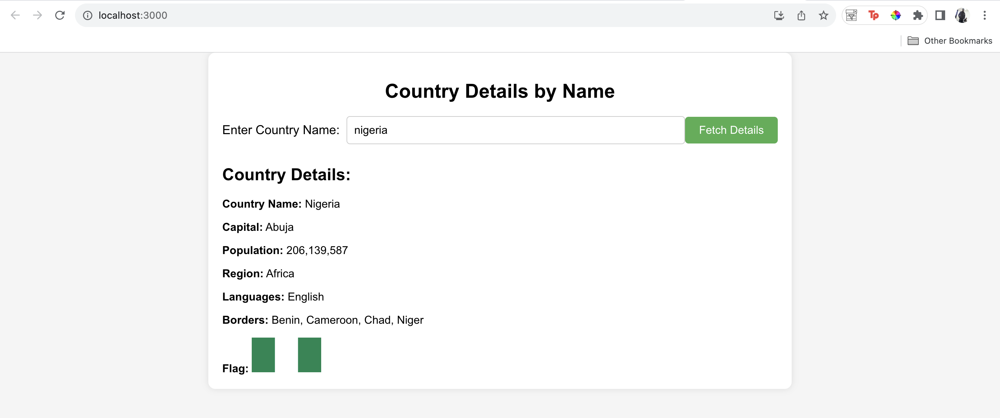

# Country Details App

Welcome to the Country Details App! This application allows users to fetch and display details about a country by entering its name. The app fetches data from the [Rest Countries API](https://restcountries.com/), providing information such as country name, capital, population, region, languages, borders, and flag.

## Getting Started

These instructions will help you set up and run the project on your local machine.

### Prerequisites

- [Node.js](https://nodejs.org/) (Version X or higher)
- [npm](https://www.npmjs.com/)

### Installation

1. Clone the repository:

git clone https://github.com/genius101/country-details-app.git

2. Navigate to the project directory:

cd client

3. Install dependencies:

npm install

## Usage

Start the development server: npm start

Open your browser and navigate to http://localhost:3000

Enter the name of a country in the input field and click "Fetch Details" to display the country's information.

## Screenshots

### Built With

React - Frontend library for building user interfaces
Axios - Promise-based HTTP client for making API requests

### Author

Habeeb Ejio
GitHub: genius101

### Acknowledgments

Thanks to Rest Countries API for providing the country data.

### License

This project is licensed under the MIT License - see the LICENSE file for details.
